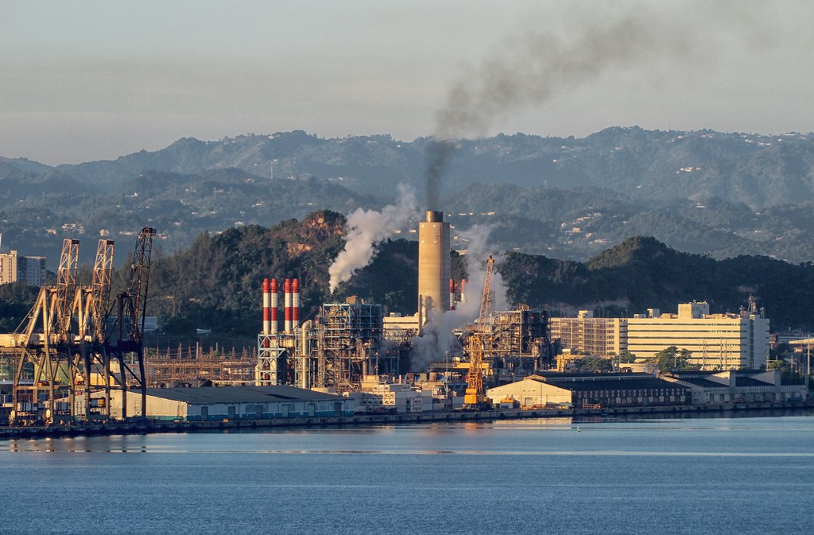

# Computing NO2 Emission from Electricity Generation using Remote Sensing

This project is about developing a methodology to quantify NO2 emission from electricity generation using satellite data and remote sensing techniques.
The main dataset used is Sentinel 5P NO2 offline satellite images from Google Earth Engine, which provides offline high-resolution imagery of NO2 concentration for all the globe.

* After applying this approach to a group of 13 power plants over USA the evaluation result was very surprising, where `the average difference between the bottom-up emission and the calculated emission was only 3.23 Ton in 2019`

### Notebook Content
    Imports
    Setup
    Utility Functions
    1 Overview
    2 Data Description
        1 Global power plant database
        2 Sentinel-5P offline NO2 dataset
        3 Evaluation Data
        4 Google Earth Engine (GEE)
    3 Methodology
    4 Implementing the Methodology Step by Step
        1 Puerto Rico power plants and NO2 images
        2 AOIs and buffer zones mask
        3 Distance weights
        4 Composite NO2 image of AOIs
        5 Total NO2 emission
    5 Individual Power Plant NO2 Emission
        1 Total NO2 emission in 2019
        2 Evaluation
    6 Conclusion

